# Re-implementing the IPM script using IPMpack
Noam Ross  
February 4, 2015  

Read in the data


```r
library(IPMpack)
```

```
## Loading required package: Matrix
## Loading required package: MASS
## Loading required package: nlme
```

```r
library(knitr)
data = read.csv("../../data/IPM-data.csv")
opts_chunk$set(cache=TRUE)
```

First, make growth and survival objects


```r
growth = makeGrowthObj(dataf = data, Formula = sizeNext~size)
surv = makeSurvObj(dataf = data, Formula = surv ~ size)
```

Each of these objects have a slot called "fit" which contains the full
glm model, so we can access them and plot them:


```r
alpha=min(data$size[which(data$size>0)],data$sizeNext[which(data$sizeNext>0)])
beta=max(data$size[which(data$size>0)],data$sizeNext[which(data$sizeNext>0)])
xs=seq(alpha,beta,length=101)
Survival=function(x)predict(surv@fit,data.frame('size'=x),type='response')
plot(data$size,jitter(data$surv,factor=0.1),pch=21,bg=rgb(1,0,0,0.5))
lines(xs,Survival(xs),lwd=4,col="blue")
```

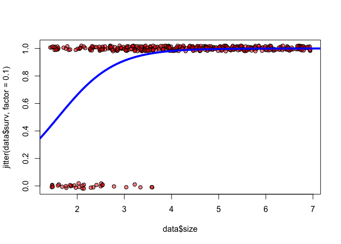 

OK, so far, not that useful.  Wait!  Just discovered built-in plotting
functions:


```r
picGrow(data, growth)
```

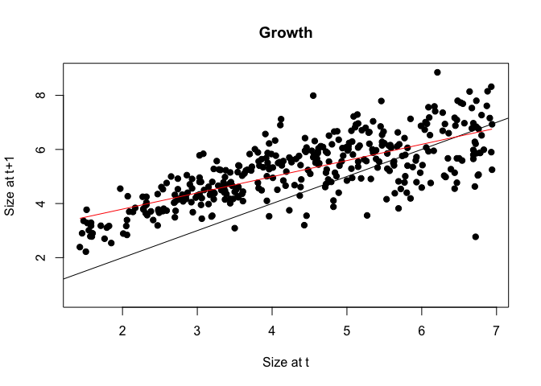 

```r
picSurv(data, surv, ncuts=101)
```

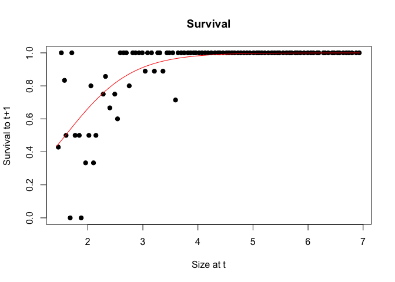 

Sebastian's plot is prettier.

Now the fecundity object, which is a little different:


```r
fec = makeFecObj(dataf = data, Formula = fec.seed ~ size, Family = 'poisson',
								 fecConstants = data.frame(sum(is.na(data$size))/
								 														sum(data$fec.seed,na.rm=TRUE)),
								 meanOffspringSize = mean(data$sizeNext[is.na(data$size)]),
								 sdOffspringSize = sd(data$sizeNext[is.na(data$size)]))
```

For whatever reason the fit object in `fec` is `fec@fitFec[[1]]`.  There's no
plot method for this.  Here's your plot of the same.  It looks like the same fit.


```r
plot(data$size,data$fec.seed,pch=21,bg=rgb(1,0,0,0.5),
		 bty="n",xlab="size",ylab="fecundity")
lines(xs,predict(fec@fitFec[[1]], data.frame('size'=xs),type="response"),lwd=2)
```

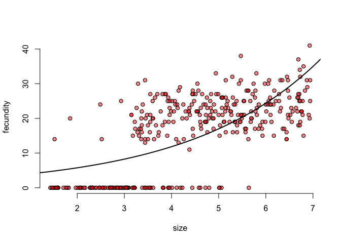 

So now we can build our matrix.  In **IPMpack**, we nest these, starting with
just the growth-by-survivial (P) matrix.  Looks like there is a midpoint
integration option.  Then we can extact various diagnostics:


```r
Pmat = makeIPMPmatrix(growObj = growth, survObj = surv, minSize=alpha,
											maxSize=beta, nBigMatrix = 101,
											integrateType = "midpoint")
diagnosticsPmatrix(Pmatrix = Pmat, growObj = growth, survObj = surv, dff = data)
```

```
## [1] "Range of Pmatrix is "
## [1] 5.275196e-19 3.967077e-02
```

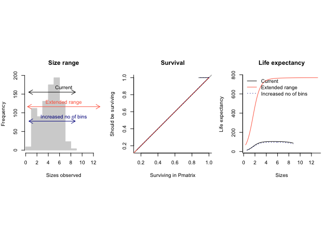 

```
## [1] "Please hit any key for the next plot"
```

 

```r
meanLifeExpect(Pmat)
```

```
##   [1]  13.79406  15.52173  17.43094  19.52863  21.81910  24.30334  26.97852
##   [8]  29.83744  32.86826  36.05433  39.37437  42.80286  46.31074  49.86636
##  [15]  53.43658  56.98803  60.48830  63.90712  67.21735  70.39565  73.42304
##  [22]  76.28504  78.97170  81.47729  83.79991  85.94102  87.90484  89.69778
##  [29]  91.32793  92.80452  94.13753  95.33727  96.41410  97.37824  98.23953
##  [36]  99.00733  99.69045 100.29708 100.83480 101.31053 101.73058 102.10069
##  [43] 102.42601 102.71118 102.96037 103.17727 103.36518 103.52705 103.66546
##  [50] 103.78270 103.88080 103.96153 104.02643 104.07687 104.11400 104.13884
##  [57] 104.15226 104.15497 104.14758 104.13058 104.10434 104.06916 104.02521
##  [64] 103.97258 103.91128 103.84122 103.76220 103.67396 103.57613 103.46824
##  [71] 103.34972 103.21989 103.07797 102.92303 102.75406 102.56988 102.36920
##  [78] 102.15058 101.91244 101.65303 101.37047 101.06272 100.72759 100.36273
##  [85]  99.96565  99.53375  99.06425  98.55432  98.00099  97.40126  96.75203
##  [92]  96.05025  95.29282  94.47674  93.59907  92.65702  91.64796  90.56949
##  [99]  89.41948  88.19610  86.89789
```

```r
passageTime(mean(data$size, na.rm = TRUE), Pmat)
```

```
##   [1] 60.48439 60.40853 60.32734 60.24142 60.15155 60.05862 59.96369
##   [8] 59.86793 59.77266 59.67929 59.58937 59.50452 59.42645 59.35691
##  [15] 59.29770 59.25065 59.21757 59.20026 59.20044 59.21980 59.25993
##  [22] 59.32229 59.40824 59.51896 59.65549 59.81868 60.00919 60.22747
##  [29] 60.47377 60.74810 61.05025 61.37977 61.73601 62.11806 62.52479
##  [36] 62.95488 63.40678 63.87875 64.36890 64.87517 65.39534 65.92714
##  [43] 66.46817 67.01600 67.56817  0.00000  0.00000  0.00000  0.00000
##  [50]  0.00000  0.00000  0.00000  0.00000  0.00000  0.00000  0.00000
##  [57]  0.00000  0.00000  0.00000  0.00000  0.00000  0.00000  0.00000
##  [64]  0.00000  0.00000  0.00000  0.00000  0.00000  0.00000  0.00000
##  [71]  0.00000  0.00000  0.00000  0.00000  0.00000  0.00000  0.00000
##  [78]  0.00000  0.00000  0.00000  0.00000  0.00000  0.00000  0.00000
##  [85]  0.00000  0.00000  0.00000  0.00000  0.00000  0.00000  0.00000
##  [92]  0.00000  0.00000  0.00000  0.00000  0.00000  0.00000  0.00000
##  [99]  0.00000  0.00000  0.00000
```

Now let's add fecundity.


```r
Fmat = makeIPMFmatrix(fec, minSize = alpha, maxSize = beta, nBigMatrix=101,
											survObj = surv, growObj = growth)
```

We can calculate the stable age distribution and lambda:


```r
calcs = largeMatrixCalc(Pmat, Fmat)
```

```
## Convergence:  2.339655e-09  should be less than  1e-08
```

```r
calcs$lam
```

```
## [1] 1.160584
```

```r
plot(as.vector(calcs$stableDist))
```

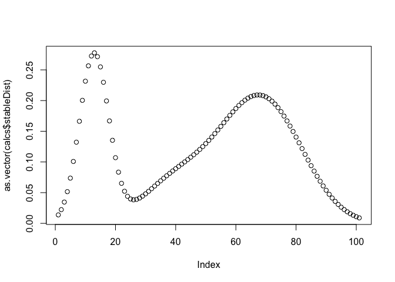 

And plot a contour map:


```r
image(Pmat + Fmat)
contour(Pmat + Fmat, add=TRUE)
```

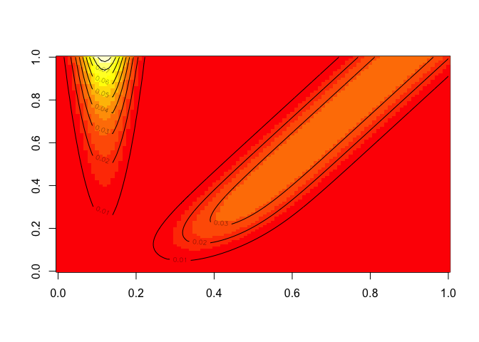 

I can handle the zero-inflation in the fecundity data, too, by creating a
fecundity function that explictly deals with flowering. 


```r
data2= data
data2$fec.seed[data$fec.flower == 0] = NA
fec2 = makeFecObj(dataf = data2, Formula = list(fec.flower ~ size, fec.seed ~ size),
								 Family = c('binomial', 'poisson'),
								 fecConstants = data.frame(1, sum(is.na(data$size))/
								 														sum(data$fec.seed,na.rm=TRUE)),
								 Transform = c("none", "-1"),
								 meanOffspringSize = mean(data$sizeNext[is.na(data$size)]),
								 sdOffspringSize = sd(data$sizeNext[is.na(data$size)]))
Fmat2 = makeIPMFmatrix(fec2, minSize = alpha, maxSize = beta, nBigMatrix=101,
											survObj = surv, growObj = growth)
```

Here are the flowering probability and seed production plots


```r
plot(data$size,jitter(data$fec.flower,factor=0.1),pch=21,bg=rgb(1,0,0,0.5),
		 bty="n",xlab="size",ylab="flowering probability")
lines(xs, predict(fec2@fitFec[[1]], data.frame('size'=xs),type="response"),lwd=2)
```

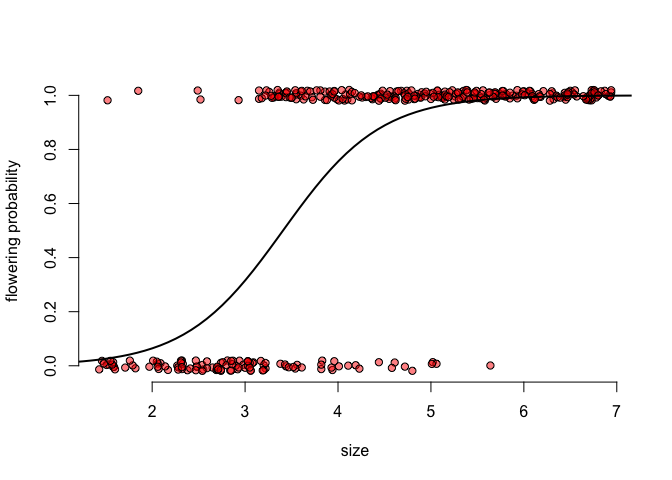 

```r
plot(data$size,data$fec.seed,pch=21,bg=rgb(1,0,0,0.5),
		 bty="n",xlab="size",ylab="seed fecundity")
lines(xs,predict(fec2@fitFec[[2]], data.frame('size'=xs),type="response"),lwd=2)
```

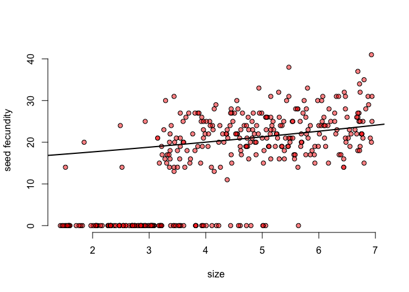 

And we can compare the old and new fecundity matrices:


```r
par(mfrow=c(1,2), mar=c(1,1,3,1))
persp(Fmat[seq(1,101,length.out=50), seq(1,101,length.out=50)], main="Poisson Only", zlim=c(0, 0.1), theta=20)
persp(Fmat2[seq(1,101,length.out=50), seq(1,101,length.out=50)], main="Binomial Flowering\nPoisson Seeds", zlim=c(0, 0.1), theta=20)
```

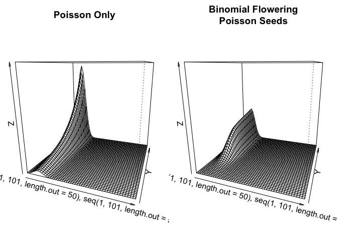 

```r
par(mfrow=c(1,1))
```

With this new fecundity matrix here are our outcomes:


```r
calcs2 = largeMatrixCalc(Pmat, Fmat2)
```

```
## Convergence:  3.770875e-09  should be less than  1e-08
```

```r
calcs2$lam
```

```
## [1] 1.136778
```

```r
plot(as.vector(calcs2$stableDist))
```

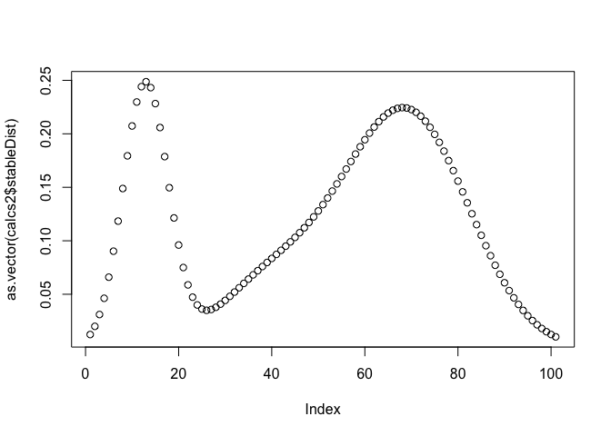 


OK, initial conclusions:

1.  This package pretty much does what we expect it to.
2.  I HATE it's syntax and API.


